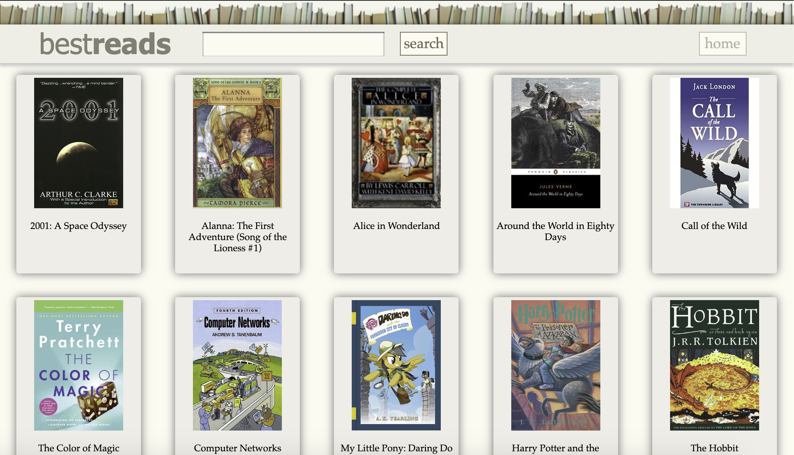
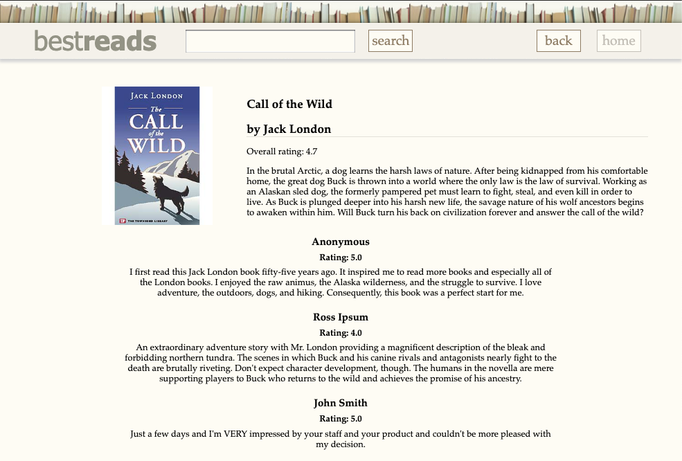
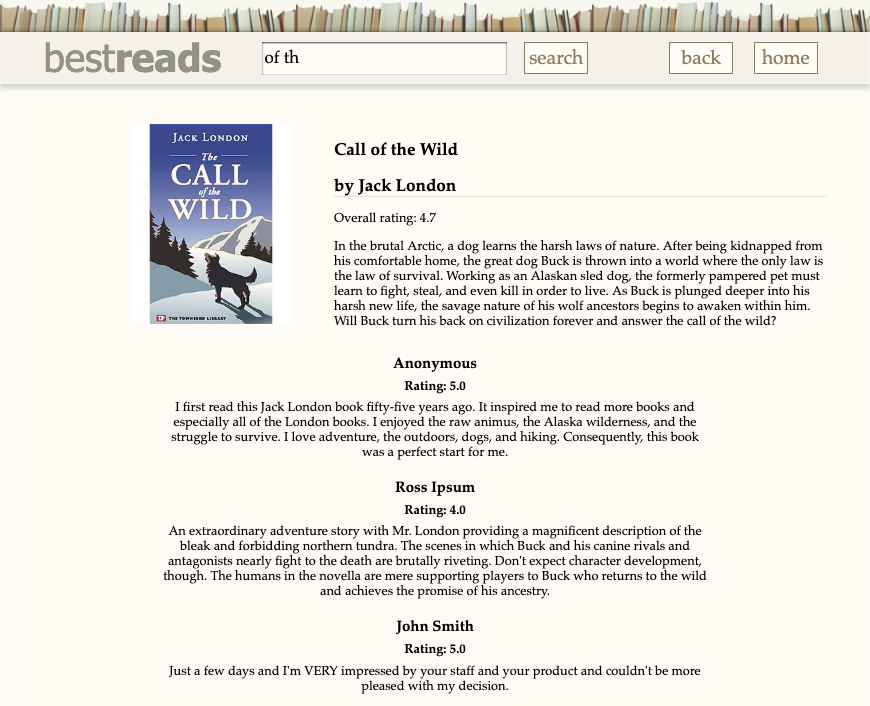
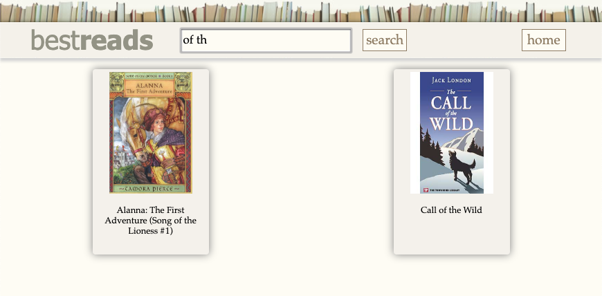

# Homework 4 - Bestreads - Project Specification

*Special thanks to Allison Obourn for the original version of this assignment, and Lauren Bricker for incorporating a nifty search feature.*

## Overview
This assignment is about making a web service and using AJAX to retrieve data
from it. You will write a PHP service that will generate a variety of data about
different books depending on the parameters it is sent. You will also write
JavaScript to make requests to this service and use the responses to update pages on your site.

**Provided Video:** You can find a supplementary video demonstrating the expected behavior between different views and user interaction on the CSE 154 homeworks page [here](https://courses.cs.washington.edu/courses/cse154/19sp/homework/homework.html).

<p>
  
</p>
Figure 1: Bestreads front page (rendered in Chrome on Mac OSX)  


### Learning Objectives
* Continue to practice all of the CSE 154 learning objectives from previous assignments, including:
    * Carefully reading and following assignment specifications, and more broadly, webpage
specifications given visual and text-based artifacts as a design basis.
    * Reducing redundancy in your code while producing expected output.
    * Listening and responding to user events using JS event handlers on DOM objects.
    * Modifying your web page using JS and DOM objects.
    * Producing quality readable and maintainable code with unobtrusive modular JavaScript.
    * Clearly documenting your code using JSDoc conventions as specified in the CSE 154 Code Quality Guide.
    * Fetch plain text and JSON data from a web service using AJAX with `fetch`.
    * Implement toggling between view states using JS and provided CSS helper classes.
* Building an API that responds to GET requests using the PHP language.
* Using the PHP language to read information from the server's file system.
* Producing quality readable and maintainable JS/PHP code with clear documentation.

### Starter Files and Final Deliverables

In this HW4 repository you will find the following starter files:

| File/folders&nbsp;&nbsp;&nbsp;&nbsp;&nbsp;&nbsp;    | Repository files to stay unchanged |
|--------------------|------------------------------|
| `bestreads.html` |  The HTML page for displaying a Bestreads page.|
| `bestreads.css`  |  The stylesheet for `bestreads.html`. |
| `books/`         | The books directory with all of the book images, details and review files.|
| `images/`        | All images used by the HTML and CSS for the webpage. |
| `screenshots/`   | A folder of screenshots for this `README.md` |

Your repository should be submitted with these (**unchanged**) starter files (with one exception below)
as well as the following files you are to implement:

| File          | Repository file you will implement and turn in |
|---------------|------------------------------|
| `bestreads.php` |The PHP service that will supply the book data. |
| `bestreads.js`  | The JavaScript that will request the information from `bestreads.php` and populate it into `bestreads.html`. |

Your solution will be graded only on `bestreads.php` and `bestreads.js` - any changes you
make to `bestreads.html` or `bestreads.css` will not be eligible for full credit.


### External Requirements
Your webpage should match the overall appearance/behavior of the provided screenshots and
it **must** match the appearance/behavior specified in this document.

You are to implement both `bestreads.js` and `bestreads.php` in this assignment. Your `bestreads.js` will use AJAX with `fetch` to request data from your `bestreads.php` service and insert it into the provided
`bestreads.html`. Since `bestreads.js` depends on `bestreads.php`, you may find it easier to start with `bestreads.php`. But can be helpful to have an idea of how the user interface bestreads website should work.

We recommend reading through the rest of the spec, and then starting with either `bestreads.php` (most TAs/students share this is easier to start with) or `bestreads.js`, re-reading the relevant sections in this specification and referencing the provided video as you're working on the implementations.

## The Bestreads User Interface (HTML/CSS/JS)
There are three main views that a user may see on the bestreads webpage. Only one of these views should be visible at any time - the other views should be hidden using the provided `.hidden` class in `bestreads.css`.

### 1. Book List View
This view (`#book-list`) will be displayed when the page initially loads, when the (enabled) `#home` button is clicked, or when a successful search query is made. When displayed, a grid-like collection of selectable books (with covers and titles) will be shown.

When the page is initially loaded or when the `#home` button is clicked (when it is not disabled), all books should be requested from the bestreads web service with `mode=books` and the page should be populated to display the images and titles of each book returned (as depicted in Figure 1). When this view is shown as a result of a search query (more details in The Search Feature part of this spec), only books returned from the search request should be populated.

When populating the `#book-list`, each book should be created in its own `div` which contains the book's cover (an image) and the book's
title (as a paragraph). The `div` elements you create to hold each book image/title pair
should be added as children to the `#book-list` article.  Only books from the request should be displayed (replacing any previous collection in the view), and only one book `div` should appear for each book in the response.

Clicking on any portion of a book cover (the title, image
or container holding both) should then transition to the `#single-book` view to show the book details page. It should be apparent to the user that they can click on a book. Thus, the
cursor should turn to a pointer when the user's mouse is hovering over either a book
cover, title, or container. To assist you we have provided the `.selectable` class in
`bestreads.css` which you should add to the `div` of a book. The `#home`, `#back`, and `#search-btn` elements are already set to include this class in the provided HTML.

### 2. Single Book View
This view (`#single-book`) will be populated with all of the information about a book clicked from the `#book-list` view, as shown in Figure 2. Whenever this is the current view, the `#back` button should be displayed and the `#home` button's enabled or disabled state will not change (the `#home` button's enabled/disabled state is related to what list of books was shown in the `#book-list`, as discussed in **The Home and Back Buttons** section below).

<p>
  
</p>

Figure 2: Bestreads single book image page after clicking "Call of the Wild" book from Figure 1 (rendered in Chrome on Mac OSX)  


<p>
  
</p>

Figure 3: Bestreads single book image page after clicking "Call of the Wild" book from Figure 6 (rendered in Chrome on Mac OSX)  


You will send the necessary GET requests to the `bestreads.php` for data for this book, using the returned data to display its cover
image, title, author, description and reviews in the `#single-book` section (replacing any information from a previous book in this view).

The title and author should be inserted into the `#book-title`, `#book-author` elements. The book description should be inserted into the `#book-description`.

For the reviews, you will need to create elements to append information for each review in the `#book-reviews` section of the page:
  * The name of the reviewer and should be placed into an `h3`.
  * The rating of the review should be placed in an `h4` prepended with `"Rating: "`. For example if a
  review had a rating of 4.3 from a reviewer, the second line of the review would display:
  ```Rating: 4.3 ```.
  * The text of the review should be inserted into a `p` element.
  * The `h3`, `h4` and the `p` may be appended directly into the `#book-reviews` section.
* You will also need to calculate and display the value for the `#book-rating` element of the `#single-book` section. This
can be accomplished by averaging the ratings from each review (above). You may assume all books have at least one review for the purposes of this calculation.

**Details about Rating Formats:**  
The ratings returned from the `bestreads.php` web service are not guaranteed to be formatted consistently (for example, a rating for one review may be 3 and the rating for another review may be 3.0). All ratings (`#book-rating` and the `h4` for each review rating) should be displayed consistently on the bestreads website rounded to 1 decimal place, otherwise whole numbers will be output without a decimal (which is inconsistent for a
rating scheme).

To accomplish this formatting for all ratings (for the `#book-rating`, make sure to format _after_ calculating the average), you should use the
[`toFixed`](https://developer.mozilla.org/en-US/docs/Web/JavaScript/Reference/Global_Objects/Number/toFixed) function which returns a string representation of a Number guaranteeing a precision of 1 digit after the decimal. For example, a rating of 3, 2.9, or 3.03 should all be formatted and displayed as 3.0, and a rating of 4.5 should be formatted and displayed as 4.5.

```javascript
let rating = 3; // or 2.9 or 3.03
let formattedRating = rating.toFixed(1); // "3.0"
```

### 3. Error Message View
This view is just an `h3` with the id `#error-text`. The error messages below should be displayed when either a search request is sent that does not match any books, or when
an error occurs during a request to the `bestreads.php`.

If a search results in no books being returned from the server, the `#error-text` should appear with
the message "No books found that match the search string '&lt;searchterm&gt;', please try again." replacing `<searchterm>` with the trimmed search phrase. An example is shown in Figure 4:

<p>
  
</p>

Figure 4: No books returned from query (rendered in Chrome on Mac OSX)  


If at any time there is an error when making a request to the `bestreads.php` web service, the `#error-text` should appear
with the message "Something went wrong with the request. Please try again later." (this functionality should happen for all `catch` statements in fetch requests). An example screenshot is provided below:

<p>
  
</p>

Figure 5: Sample bestreads request error displayed (rendered in Chrome on Mac OSX)  


### Interacting with UI Elements

#### The Home and Back Buttons
The `#home` button in the upper right corner of the screen will also be enabled/disabled during different views. It is always visible, but should only be enabled when the current view is the `#error-text` or after a search query, where a subset of books are shown in the `#book-list` view.

If clicked (when not disabled):
* A request should be made to the bestreads web service (`mode=books`) to repopulate the page with all books (similar to the behavior when the page initially loads)
* The user will be returned to the `#book-list` view and the `#home` button should become disabled (it will appear grayed-out due to the `#home:disabled` rules in the provided CSS).
* Any text in the `#search-term` input should be cleared.
* The `#back` button should be hidden.

The `#back` button is used to take the user back to the previous state of the `#book-list` when the current view is `#single-book`. It should be hidden when the current view is `#book-list` or `#error-text`.

#### The Search Feature
The bestreads website also features a search bar for users to search for books with titles that
contain the input text (case-sensitive). The search phrase will be defined as the trimmed value of the `#search-term` (use the `str.trim()` function to get a new string resulting from removing all leading/trailing whitespace on the string `str`). Whenever the user clicks the `#search-btn`:
* If the trimmed search phrase is empty, nothing should happen.
* Otherwise, a request to `bestreads.php` should be sent with the trimmed value of the `#search-term` input passed as the `search` parameter for `mode=books`. Upon a successful response from the web service, the current collection of books in `#book-list` should be replaced with books from the response data and the `#book-list` view should be shown.

<p>
  
</p>

Figure 6: Bestreads book list view after search (rendered in Chrome on Mac OSX)  


If the user enters a string that does not match any of the book titles (as determined by the response of the web service detailed in the **Query 1** section later in the spec), the current view should transition to the `#error-text` view as described in the above **Error Message View** part of this spec.

## `bestreads.php` Web Service Overview
The `books` directory contained in this repository will contain the input files for many books, and should stay in the same directory as your HTML, CSS, JS, and PHP files. This will allow you to use relative paths to the files in each directory,
such as `books/harrypotter/info.txt` and `books/wizardofoz/cover.jpg` in your code, which will be
necessary in order for your site to function properly when turned in.

All subdirectories for books follow a strict lowercase naming convention with no spaces. You are to retrieve the book details (based on the mode variable's value: `description`,
`info`, or `reviews`) in the subdirectory corresponding to the title parameter.

For example, the book `harrypotter` stores its files in a folder named
`books/harrypotter/`. This folder will contain the following text files:
  * `description.txt`
  * `info.txt`
  * A collection of numbered review files: `review1.txt`, `review2.txt`, ... (the number of reviews may vary).

All extraneous trailing whitespace from information read in from the above files should be removed before being returned by your web service. You may find the PHP `trim` function useful for handling this,
but also note that part of your grade will come from not overusing string/array/file functions (keep
efficiency and redundancy in mind).


### `bestreads.php` Request Details
Your service will support 4 types of GET requests, responding with different data depending on what parameters are sent in a request:
1. A `mode` of `books` (with an **optional** `search` parameter)
  * Example: `bestreads.php?mode=books`
  * Example: `bestreads.php?mode=books&search=otter`


2. A `mode` of `description` (with a **required** `title` parameter)
  * Example: `bestreads.php?mode=description&title=harrypotter`


3. A `mode` of `info` (with a **required** `title` parameter)
  * Example: `bestreads.php?mode=info&title=harrypotter`


4. A `mode` of `reviews` (with a **required** `title` parameter)
  * Example: `bestreads.php?mode=reviews&title=harrypotter`


Remember that your PHP code can retrieve these parameters into local variables using code such as the following: `$book = $_GET["title"]`. All of your PHP code should use these parameters’ values, and you should never hard-code particular book names.

#### Handling Invalid Requests
Your web service should handle any invalid request (e.g. missing or incorrect parameters) with 400 (Invalid Request) errors, depending on the GET parameters sent. Each error should be output with a particular message **in plain text** to let a client know why their request was invalid, and no other output should be produced. The following are errors your service should handle, in order of precedence:
  * If the required GET `mode` parameter is missing or is passed as something other than one of the 4 valid modes (case-sensitive), an error should be returned with the message:

    `"Please provide a mode of description, info, reviews, or books."`
  * If the `mode` is passed as `description`, `info`, or `review` and the required `title` parameter is missing, an error should be returned with the message:

    `"Please remember to add the title parameter when using mode=<mode>."`

    (replacing `<mode>` with whatever the passed `mode` is)

  * If the `mode` is passed as `description`, `info`, or `review` and the required `title` parameter was passed but no book for that title was found (including an empty title), an error should be returned with the message:

    `No <mode> for <title> was found.`

    (replacing `<mode>` with the passed `mode` and `<title>` with the passed `title`)


#### Query 1: Get the list of books
**Request Format:** `bestreads.php?mode=books` (with optional `search={searchterm}` parameter)  
**Request Type:** `GET`  
**Returned Data Format:** JSON  
**Description:** Outputs JSON containing the titles and folder names for books that you have data
for. Your overall JSON object should have one property `"books"` that points to an array of books. Each book should
be represented by an object with two properties: `title`, and `folder`. You’ll need to extract the title of
the book from the book’s `info.txt`. The folder property should be set to the name of the folder that contains
the resources about that particular book.  You should find all the books inside the books folder, and build JSON containing information about each one.

If they `search` parameter is not passed, the JSON will contain title/folder data for **all** books in the `books` directory.

Otherwise, the value of the `search` parameter will be used to filter out the result JSON so that it includes only books where the titles are a case-sensitive match to
the passed search term. You should use the extracted the title of the book from the `info.txt` for each book when checking whether the titles are a case-sensitive match to
the search term passed in.

**Example Request:** `bestreads.php?mode=books`  
**Example Output:** (abbreviated)  
```
{
  "books" : [
    {
      "title": "Harry Potter and the Prisoner of Azkaban (Harry Potter #3)",
      "folder": "harrypotter"
    },
    {
      "title": "The Hobbit",
      "folder": "hobbit"
    },
    ... (one entry like this for each folder inside books/)
  ]
}
```

**Example Request:** `bestreads.php?mode=books&search=otter`  
**Example Output:**
```
{
  "books" : [
    {
      "title": "Harry Potter and the Prisoner of Azkaban (Harry Potter #3)",
      "folder": "harrypotter"
    }
  ]
}

```
If no books are found the object returned by the API will contain an empty `books` array, e.g.:
```
{
  "books" : []
}
```


#### Query 2: Get a book’s description
**Request Format:** `bestreads.php?mode=description&title={title}`  
**Request Type:** `GET`  
**Returned Data Format:** plain text  
**Description:** The `title` parameter must also be passed with this mode. Your service should locate the file  
called `description.txt` for the book, and output the entire contents as plain text.  
**Example Request:** `bestreads.php?mode=description&title=harrypotter`  
**Example Output:** (abbreviated)  
```
Harry Potter is lucky to reach the age of thirteen, since he has already survived the murderous
attacks of the feared Dark Lord on more than one occasion. But his hopes for a quiet term
concentrating on Quidditch are dashed when a maniacal mass-murderer escapes from Azkaban, pursued
by the soul-sucking ...
```

#### Query 3: Get a book’s information
**Request Format:** `bestreads.php?mode=info&title={title}`  
**Request Type:** `GET`  
**Returned Data Format:** JSON  
**Description:** Your service should output the contents of `info.txt`, a file with two lines of
information about the book: its title and author in JSON format.  
**Example Request:** `bestreads.php?mode=info&title=harrypotter`  
**Example Output:** (abbreviated)  

```json
{
  "title":"Harry Potter and the Prisoner of Azkaban (Harry Potter #3)",
  "author":"by J.K. Rowling, Mary GrandPr\u00e9 (Illustrator)"
}
```

#### Query 4: Get a book’s reviews
**Request Format:** `bestreads.php?mode=reviews&title={title}`  
**Request Type:** `GET`  
**Returned Data Format:** JSON  
**Description:** Output an array (in JSON format) containing all of the reviews for the book, the review rating, and
the name of the reviewer. The reviews are stored in files called `review1.txt`, `review2.txt`, etc. Each file
contains one review for each book which is exactly three lines: The reviewer’s name, the number of rating they
gave the book and their review. If a book has 10 or more reviews, the names will be e.g. `review01.txt`, ....
So don’t hard-code file names like "`review1.txt`"; instead, look for all files that begin with "`review`" and end
with "`.txt`".  
**Example Request:** `bestreads.php?mode=reviews&title=harrypotter`  
**Example Output:** (abbreviated)  
```json
[
  {
    "name" : "Wil Wheaton",
    "rating" : 4,
    "text" : "I'm beginning to wonder if there will ever be a Defense Against The Dark Arts teacher who is just a teacher"
  },
  {
    "name" : "Zoe",
    "rating" : 5,
    "text" : "Yup yup yup I love this book"
  },
  {
    "name" : "Kiki",
    "rating": 5,
    "text" : "Literally one of the best books I've ever read. I was chained to it for two days."
  }
]
```


## Development Strategies

* PHP code is difficult to debug if you have errors. Write the program incrementally, adding small pieces of
code to a working page, and not advancing until you have tested the new code. The following functions
may be helpful:

  * `count` - returns the number of elements in an array
  * `explode` - breaks apart a string into an array of smaller strings based on a delimiter
  * `file` - reads the lines of a file and returns them as an array
  * `glob` - given a file path or wildcard such as `"foo/bar/*.jpg"`, returns an array of matching file names
  * `scandir` - returns an arrayall of the file names in a given directory (including `.` and `..`)
  * `list` - unpacks an array into a set of variables; useful for dealing with fixed-size arrays of data
  * `trim` - removes whitespace at the start/end of a string (gets rid of stray spaces in output)
  * `strpos` - finds the position of the first occurrence of a substring in a string, or returns `false` if the substring is not found

* We recommend developing the PHP parts of the assignment first, as it can be hard to track down problems
in JS and PHP at the same time.
* Before using JS to test your PHP page, consider using your browser to visit your PHP URL, passing
the appropriate query parameters, until you are satisfied that your PHP program is producing the correct
output. Then, build your AJAX calls to use the PHP web services to make sure you can get the correct
data into your JS program. From there, use JS to modify the page appropriately.
* Make sure to test your code on all available books in the repository. You may want to think about other
edge cases, such as what your page should do if the book has only a single review, etc. You should not
have code that depends on particular books or uses if/else statements to see which book to display.
* Think about how you can refactor some of the common functionality in both your JS and your PHP code.  
* Use the CSE 154 JSLint to look for possible errors or warnings. For full credit, your JS
code must pass the provided JSLint tool with no errors reported. ("Warnings" are okay.)

## Internal Requirements
For full credit, your page must not only match the external requirements listed above, but must also
demonstrate good use of JS and PHP and overall code quality. This includes the following requirements:

* Your JS and PHP should maintain good code quality as demonstrated in class and
  detailed in the [CSE 154 Code Quality Guidelines](https://courses.cs.washington.edu/courses/cse154/codequalityguide/_site/). We also expect you to implement relevant feedback from previous assignments. As usual, we have included some common things relevant to this assignment below.
* All programatically-generated image DOM elements should be given an alt tag.
* Your `.js` file must be in the module pattern and run in strict mode by putting `"use strict";`
  within your file (inside your module pattern).
* Do not use any global variables, and minimize the use of module-global variables. Do not ever
  store DOM element objects, such as those returned by the `document.getElementById` function, as
  module-global variables. Other variables should be localized as much as possible.
* Do not use the PHP `global` keyword.  
* If a particular literal value is used frequently in JS, declare it as a module-global "constant" (`const`)
`IN_UPPER_CASE` and use the constant in your code.
* Similar to JS, use === over == in PHP for strict equality checks.
* Avoid unnecessary fetch requests to `bestreads.php` - you should only make requests where needed to update DOM elements based on the expected behavior outlined in this spec. We **strongly** recommend walking through different interactions on your page with the Networks table to see how often you are making fetch requests.
* Your PHP web service should use isset to check for required GET parameters before using them.
* Do not overwrite the content type with `header` in PHP - the content type should be set exactly once before outputting any response (including for error responses). Similarly, do not set the content type after any print/echo output.
* Minimize redundant JS and PHP code. Capture common operations as functions to keep code size and complexity from growing. You should not have any functions that are more than 30 lines of code.
  * In JS you can reduce your code size by using the `this` keyword in your event handlers.
  * Utilize PHP functions for good readability and program decomposition. Capture common operations as functions to keep code size and complexity from growing. Refer to code from lecture/sections for examples of PHP web service decomposition.
* Separate content (HTML), presentation (CSS), and behavior (JS). Your JS code should use styles and classes from the CSS when provided rather than manually setting each style property in the JS. For example, rather than setting the
`.style.display` of a DOM object to make it hidden/visible, instead, add/remove the `.hidden`
class in the provided CSS to the object's `classList`.
* To hide and display elements (e.g. when switching views) You may find the `classList`'s toggle, remove, and/or add [functions](https://developer.mozilla.org/en-US/docs/Web/API/Element/classList#Methods) helpful (note that no error will occur when removing/adding a class that is missing/present on an element).
* You must not use any external JS frameworks or libraries such as jQuery to solve this assignment.
* For full credit, your page must use valid JS and successfully pass our
  [CSE 154 JSLint](https://oxford.cs.washington.edu/cse154/jslint/) with no errors.
* Format your JS and PHP to be as readable as possible, similarly to the examples from class:
  * Place a comment header in each file with your name, section, a brief description of the assignment,
    and the files contents (examples have been given on previous assignments).
  * Properly use whitespace and indent your code as shown in class and in the CSE
    154 code quality guide.
  * To keep line lengths manageable, do not place more than one block element on the same line or
    begin a block element past the 100th character on a line.
  * Use JSDoc to properly document all of your JS functions with `@param` and `@returns` where necessary as described in the CSE 154 Code Quality Guide.
  *  Your PHP variables and functions should be similarly documented in a style like JSDOC documenting the method’s description, parameters and return values.
  * Remember to use use proper `under_score` naming conventions for PHP variables and functions, as specified in the [Code Quality Guide](https://courses.cs.washington.edu/courses/cse154/codequalityguide/_site/php/#naming-conventions).
* Do not include any files in your final repository other than those outlined in "Starter Files and Final Deliverables"

## Grading
This assignment will be out of 30 points. The key areas we will be looking at assess directly relate
to the learning objectives, and your matching the specification for the external behavior as well as
the internal correctness of your code. **NOTE:** While we can not guarantee the same distribution of
points, past rubrics have been split with 60% of the points allocated to external correctness and
the 40% for internal. Thus a **potential** rubric **might be** summarized as:  

### External Correctness (18 pts)
*  web service (PHP)
  * accesses and uses parameters correctly
  * correctly responds to the 4 modes (`description`, `info`, `reviews`, `books`)
  * correctly responds to a search query request
  * correctly responds with to invalid requests with plain text error messages with the 400 status code
* service client (JS)
  * displays all book images and titles on page load
  * displays information on single book click, including calculated overall rating
  * home and back buttons work correctly
  * multiple books can be viewed properly
  * search bar works correctly
  * errors are handled and displayed correctly

### Internal Correctness (12 pts)
* PHP
  * sets content type and error modes appropriately and only when necessary
  * avoids redundancy and follows [PHP Code Quality Guidelines](https://courses.cs.washington.edu/courses/cse154/codequalityguide/_site/php)
  * uses functions to handle different parts of the PHP program
  * factors redundancy in PHP (similar functionality for finding books or handling errors)
  * uses `json_encode` correctly
* JavaScript
  * Passes the [CSE 154 JSLint](https://oxford.cs.washington.edu/cse154/jslint/) and follows
  [JS Code Quality Guidelines](https://courses.cs.washington.edu/courses/cse154/codequalityguide/_site/javascript)
  * Demonstrates appropriate use of Ajax `fetch`
  * Demonstrates appropriate use of JSON
  * No globals (module pattern); minimizes module-globals; uses variables well
  * Factors redundancy in JS (e.g. toggling views etc.)
* All functions are clearly documented using JSDoc as described in the Code Quality guide
* Otherwise good quality code - a catch all for things like indentation, good identifier names,
long lines, large anonymous functions, etc.

## Academic Integrity
All work submitted for your CSE 154 homework assignments must be your own and should not be shared with other students. This includes but is not limited to:
* You may not use code directly from any external sources (no copying and pasting from external sites), other than templates that are explicitly given to students for use in class.
* We expect that the homework you submit is your own work and that you do not receive any inappropriate help from other people or provide inappropriate help to others.
* You must not place your solution to a publicly-accessible web site, neither during nor after the school quarter is over.

Doing any of the above is considered a violation of our course [academic integrity](https://courses.cs.washington.edu/courses/cse154/19sp/syllabus/syllabus.html#academic-conduct)
policy. As a reminder, this page states:

  The Paul G Allen School has an entire page on
  [Academic Misconduct](https://www.cs.washington.edu/academics/misconduct) within the context of
  Computer Science, and the University of Washington has an entire page on how
  [Academic Misconduct](https://www.washington.edu/cssc/for-students/academic-misconduct/) is
  handled on their
  [Community Standards and Student Conduct](https://www.washington.edu/cssc/) Page. Please acquaint
  yourself with both of those pages, and in particular how academic misconduct will be reported to
  the University.

**Note about fair use for book cover images:** The book cover images for this assignment were found through various public domains (e.g. wikipedia.org). Under [Fair Use](https://www.law.cornell.edu/uscode/text/17/113), these are considered lawfully distributed for educational purposes.
